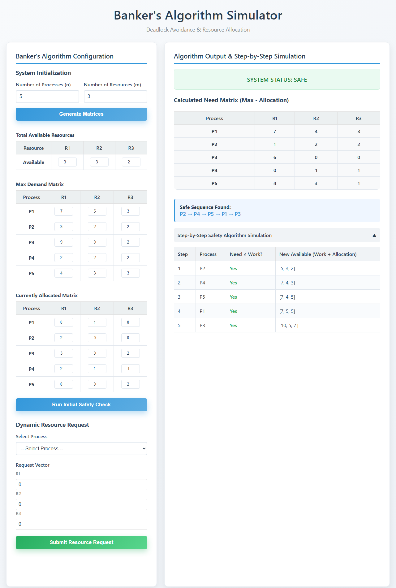
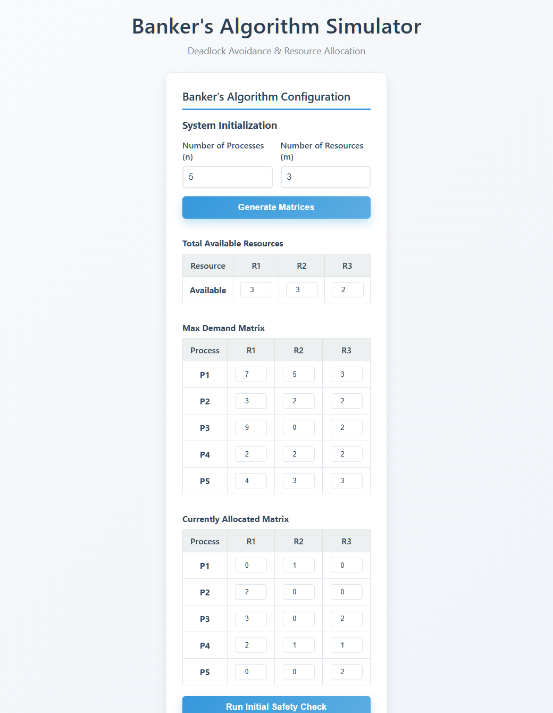
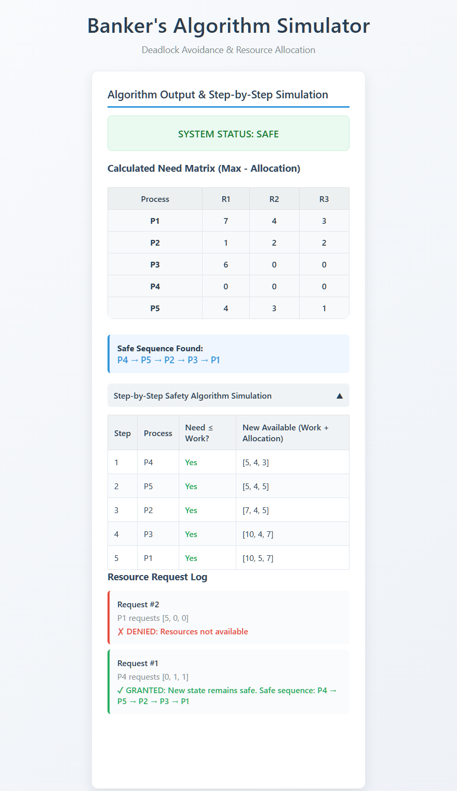

# Banker's Algorithm Simulator

[**▶ Live Demo — try it in your browser**](https://harshith0308.github.io/Bankers-algorithm-simulator/)


An interactive, browser-based simulator for the **Banker's Algorithm** — the classic
deadlock-avoidance and resource-allocation technique used in operating systems. Built
with plain HTML, CSS, and JavaScript (no frameworks, no build step), so it runs by
simply opening a file in the browser.



## Overview

In an operating system, multiple processes compete for a limited number of resource
instances. If resources are granted carelessly, the system can reach a **deadlock**,
where every process is waiting forever for resources held by another. The Banker's
Algorithm prevents this by acting like a cautious banker: before granting any request,
it checks whether doing so would still leave the system in a **safe state** — a state
from which *every* process can eventually finish.

This simulator makes that process visible. You define the system (processes, resource
types, and the *Available*, *Max*, and *Allocation* matrices), run the safety check,
and then issue live resource requests — watching the algorithm grant or deny each one
and explaining exactly why.

## Features

- **Configurable system** — set any number of processes (n) and resource types (m).
- **Editable matrices** — enter the *Available* vector, *Max* demand matrix, and
  *Allocation* matrix directly in the UI.
- **Automatic Need matrix** — computed as `Need = Max − Allocation`.
- **Safety algorithm** — determines whether the current state is safe and displays a
  valid **safe sequence** when one exists.
- **Step-by-step trace** — a collapsible table shows how the *Work* vector evolves as
  each process completes.
- **Dynamic resource requests** — submit a request for any process; the simulator
  validates it against *Need* and *Available*, tentatively allocates, re-runs the
  safety check, and grants or rolls back accordingly.
- **Request log** — every request is recorded with its outcome and the reason.

## Screenshots

### 1. System configuration

Enter the number of processes and resources, generate the matrices, and fill in the
**Available**, **Max Demand**, and **Currently Allocated** values.



### 2. Algorithm output & request handling

After running the safety check, the simulator shows the calculated **Need** matrix,
the overall **system status**, a valid **safe sequence**, a step-by-step trace of the
safety algorithm, and a log of every resource request that was granted or denied.



## Getting Started

**No install needed** — use the [live demo](https://harshith0308.github.io/Bankers-algorithm-simulator/). To run locally instead:

No installation or build is required.

1. Clone the repository:
   ```bash
   git clone https://github.com/Harshith0308/Bankers-algorithm-simulator.git
   ```
2. Open `index.html` in any modern web browser.

Alternatively, enable **GitHub Pages** (Settings → Pages → deploy from the default
branch) to host a live version directly from the repo.

## How to Use

1. Enter the **number of processes** and **number of resources**, then click
   **Generate Matrices**.
2. Fill in the **Available**, **Max**, and **Allocation** values.
3. Click **Run Initial Safety Check** to compute the *Need* matrix and find a safe
   sequence (or detect an unsafe state).
4. Optionally, select a process, enter a **Request Vector**, and click
   **Submit Resource Request** to test dynamic allocation. A request is granted only
   if it keeps the system in a safe state — otherwise it is denied and rolled back.

### Worked example

The screenshots above use the classic textbook example (5 processes, 3 resource types):

| Process | Allocation (R1 R2 R3) | Max (R1 R2 R3) |
|:-------:|:---------------------:|:--------------:|
| P1      | 0 1 0                 | 7 5 3          |
| P2      | 2 0 0                 | 3 2 2          |
| P3      | 3 0 2                 | 9 0 2          |
| P4      | 2 1 1                 | 2 2 2          |
| P5      | 0 0 2                 | 4 3 3          |

with **Available = (3, 3, 2)**. The system is **safe**, and the simulator finds a
valid completion order for all five processes.

## How It Works

The simulator implements the two algorithms from the Banker's scheme:

- **Safety Algorithm** — using a `Work` vector (initialised to *Available*) and a
  `Finish` flag per process, it repeatedly looks for a process whose remaining *Need*
  can be met by `Work`. That process is assumed to finish, releasing its resources
  back into `Work`. If all processes can finish, the state is safe and the order they
  finished in is a **safe sequence**.
- **Resource-Request Algorithm** — when a process requests resources, the request is
  checked against its *Need* and the *Available* pool, tentatively granted, and the
  Safety Algorithm is re-run. If the resulting state is safe the request is committed;
  otherwise the tentative allocation is **rolled back** and the request is denied.

## Project Structure

```
.
├── index.html      # Main page and UI markup
├── style.css       # Styling
├── script.js       # Banker's Algorithm logic and DOM rendering
└── docs/
    ├── images/                       # README screenshots
    ├── Bankers_Algorithm_Report.pdf  # Project report (PDF)
    └── Bankers_Algorithm_Report.docx # Project report (DOCX)
```

## Concepts Demonstrated

- Deadlock avoidance and the concept of a *safe state*
- The Safety Algorithm (Work / Finish vectors)
- The Resource-Request Algorithm with safe rollback
- Need / Max / Allocation / Available matrix relationships

## Tech Stack

- HTML5
- CSS3
- Vanilla JavaScript (ES6)

## License

This project is licensed under the [MIT License](LICENSE).

## Author

**Gottipati Harshith Sai**
